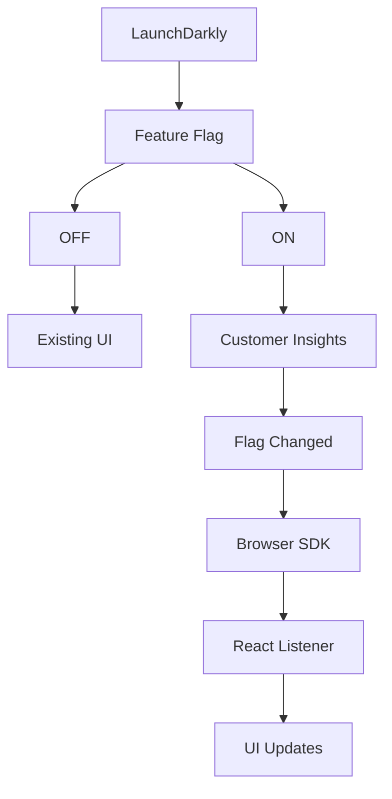
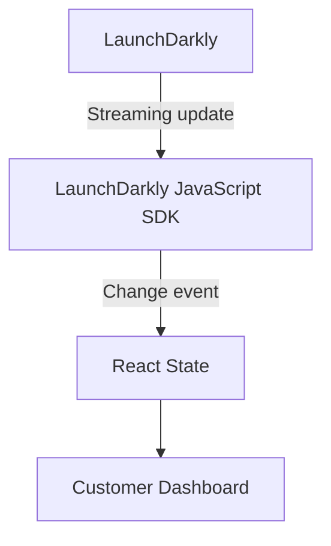
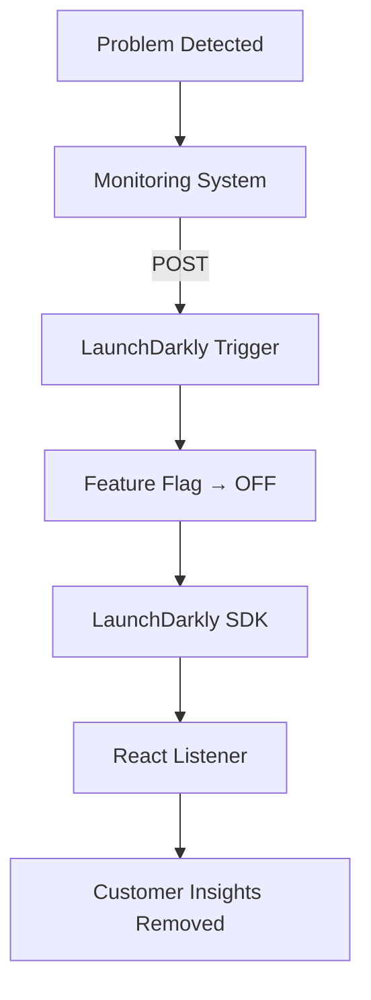

# LaunchDarkly SE Exercise

A small React + TypeScript application demonstrating how LaunchDarkly can separate **application deployment** from **feature release, targeting, and remediation**.

The application presents a customer dashboard with a gated **Customer Insights** feature. LaunchDarkly controls whether the feature is available, allowing the feature to be enabled or disabled without redeploying the application or refreshing the browser.

---

## Demo

The application demonstrates the following operational flow:

**Deploy → Release → Monitor → Remediate**



The goal is to demonstrate the operational value of feature management rather than build a complex application.

---

## Technology Stack

* React
* TypeScript
* Vite
* LaunchDarkly JavaScript Client SDK
* Node.js
* npm
* Git/GitHub

No database or backend service is required for the basic demonstration.

---

## Environment Assumptions

This project was developed and tested on **macOS**.

### Prerequisites

* macOS
* Node.js 20+
* npm
* Git
* A modern browser such as Chrome, Safari, or Firefox
* A LaunchDarkly account
* A LaunchDarkly project/environment

Homebrew is recommended for installing Node.js and other development tools.

Verify the local environment:

```bash
brew --version
node --version
npm --version
git --version
```

---

## Getting Started

### 1. Clone the Repository

```bash
git clone https://github.com/YOUR_USERNAME/launchdarkly-se-exercise.git
cd launchdarkly-se-exercise
```
*Move App.tsx launchdarkly.tsx and styles.css to the src folder. 
*Move ReleaseStatus.tsx CustomerDashboard.tsx CustomerInsights.tsx to the src/components folder. 

### 2. Install Dependencies

```bash
npm install
```

### 3. Configure LaunchDarkly

Create a `.env` file in the project root:

```env
VITE_LD_CLIENT_ID=YOUR_LAUNCHDARKLY_CLIENT_SIDE_ID
```

The application requires the **LaunchDarkly Client-side ID** for the environment being used.

> **Important:** Do not use a LaunchDarkly server-side SDK key in this application.

Do not commit `.env` to GitHub.

A `.env.example` file can be used as a template:

```env
VITE_LD_CLIENT_ID=
```

### 4. Start the Application

```bash
npm run dev
```

Vite will provide a local URL similar to:

```text
http://localhost:5173
```

Open that URL in your browser.

---

# LaunchDarkly Configuration

## Feature Flag

Create a **Boolean feature flag** in LaunchDarkly with the following configuration:

| Setting       | Value                       |
| ------------- | --------------------------- |
| Name          | `Customer Insights`         |
| Key           | `customer-insights-enabled` |
| Initial state | `OFF`                       |

Make sure the flag is available to the **LaunchDarkly client-side SDK**.

---

## Customer Context

The application uses a customer context similar to:

| Attribute    | Value          |
| ------------ | -------------- |
| Customer     | Jane Smith     |
| Customer key | `Acme-Tools` |
| Plan         | `enterprise`   |

The `plan` attribute is used later for LaunchDarkly targeting.

---

# Part 1: Feature Flag Demonstration

Start the application:

```bash
npm run dev
```

With the flag set to **OFF**, the dashboard should display the normal customer dashboard without the Customer Insights feature.

In LaunchDarkly, change:

```text
customer-insights-enabled
OFF → ON
```

The browser should receive the change through the LaunchDarkly SDK.

The application should then display:

> ✨ Customer Insights

**No browser refresh should be required.**

Change the flag back:

```text
ON → OFF
```

The Customer Insights feature should disappear without refreshing the page.

### Expected Flow



This demonstrates that a feature can be **released or rolled back independently of an application deployment**.

---

# Part 2: Targeting

The application provides a customer context with:

```text
plan = enterprise
```

Configure the LaunchDarkly flag so that:

```text
plan == enterprise
        │
        ▼
       ON
```

Customers who do not meet the targeting rule should receive:

```text
OFF
```

This demonstrates the distinction between **deployment and exposure**.

The application can be deployed once while LaunchDarkly determines which customer contexts receive the new capability.

---

# Part 3: Remediation Trigger

Create a LaunchDarkly trigger associated with:

```text
customer-insights-enabled
```

Configure the trigger to turn the feature flag **OFF**.

Store the generated trigger URL securely.

> **The trigger URL should not be exposed to browser code.**

## Important

Do **not** use:

```env
VITE_LD_TRIGGER_URL=...
```

Vite exposes variables beginning with `VITE_` to the client-side application.

A LaunchDarkly administrative/remediation trigger should remain **outside the public browser bundle**.

---

## Testing the Trigger

The trigger can be invoked from a local Mac Terminal.

For example:

```bash
export LD_TRIGGER_URL="https://YOUR_TRIGGER_URL"
```

Then:

```bash
curl -X POST "$LD_TRIGGER_URL"
```

Alternatively:

```bash
curl -X POST "https://YOUR_TRIGGER_URL"
```

---

## Remediation Flow

With Customer Insights enabled, the remediation demonstration follows this sequence:



In a production environment, the `curl` command could be replaced by an automated monitoring or incident-response system.

---

# Project Structure

```text
launchdarkly-se-exercise/
├── README.md
├── .env
├── .env.example
├── .gitignore
├── package.json
├── tsconfig.json
├── vite.config.ts
└── src/
    ├── main.tsx
    ├── App.tsx
    ├── styles.css
    ├── launchdarkly.ts
    └── components/
        ├── CustomerDashboard.tsx
        ├── CustomerInsights.tsx
        └── ReleaseStatus.tsx
```

---

# Key Components

### `launchdarkly.ts`

Initializes the LaunchDarkly client and defines the customer context used for flag evaluation.

### `App.tsx`

Waits for LaunchDarkly initialization, evaluates the feature flag, and listens for real-time flag changes.

### `CustomerDashboard.tsx`

Displays the customer dashboard and conditionally renders Customer Insights.

### `CustomerInsights.tsx`

Represents the new feature being controlled by LaunchDarkly.

### `ReleaseStatus.tsx`

Displays whether Customer Insights is currently **LIVE** or **OFF**.

### `styles.css`

Provides the presentation and responsive layout for the application.

---

# GitHub Setup

Initialize Git if necessary:

```bash
git init
```

Check the repository:

```bash
git status
```

Add the project:

```bash
git add .
```

Create the initial commit:

```bash
git commit -m "Initial LaunchDarkly SE exercise"
```

Add the GitHub remote:

```bash
git remote add origin https://github.com/YOUR_USERNAME/launchdarkly-se-exercise.git
```

Set the main branch:

```bash
git branch -M main
```

Push the repository:

```bash
git push -u origin main
```

Before pushing, verify that `.env` is not tracked:

```bash
git status
git ls-files
```

If `.env` was accidentally added:

```bash
git rm --cached .env
git commit -m "Remove environment file from repository"
```

---


# Demonstration

A simple demonstration setup uses three browser/terminal windows.

### Window 1 — Application

```text
http://localhost:5173
```

### Window 2 — LaunchDarkly

Feature flag:

```text
customer-insights-enabled
```

### Window 3 — Terminal

```bash
curl -X POST "$LD_TRIGGER_URL"
```

## Demonstration Sequence

1. Start with Customer Insights disabled.
2. Turn the LaunchDarkly flag **ON**.
3. Show the feature appearing without a browser refresh.
4. Turn the flag **OFF**.
5. Show the feature disappearing without a refresh.
6. Configure targeting for enterprise customers.
7. Enable the feature.
8. Invoke the remediation trigger from Terminal.
9. Show LaunchDarkly turning the feature **OFF**.
10. Show the browser responding to the change.

---


